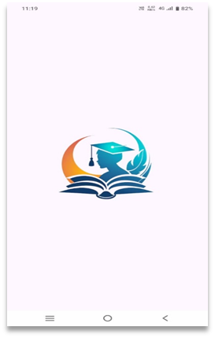
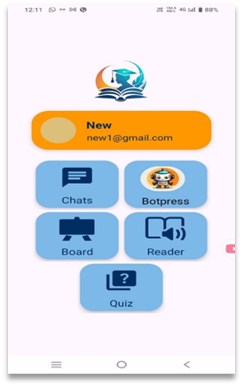
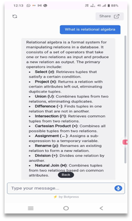
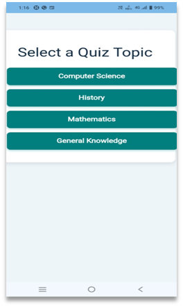
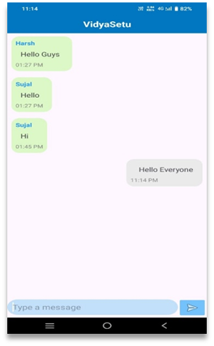
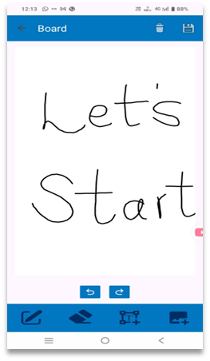
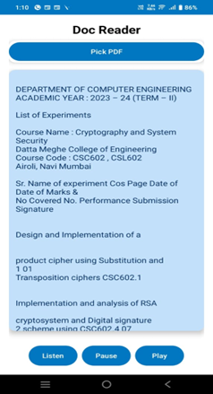

# 📚 Vidya Setu – Your All-in-One Learning Companion

**Vidya Setu** is an Android application designed to make learning smarter, more engaging, and accessible. It combines AI, real-time features, and productivity tools into one unified platform tailored for students.

---

## 🚀 Features

- 🔐 **Login & Registration** – Secure user authentication system
- 🧠 **Smart Quiz Generator**
  - Upload a PDF and auto-generate quiz questions
  - Or select a topic + difficulty level (Easy/Hard) to generate quizzes
- 🤖 **JARVIS-Style Chatbot**
  - Chat directly using natural language
  - Upload PDF and ask questions about the content
- 🖊️ **Digital Whiteboard** – A personal sketchpad for jotting ideas and solving problems visually
- 💬 **Group Chat** – Create and join chat groups with fellow learners
- 📄 **Smart Document Reader** – Integrated PDF reader for quick reference

---

## 🛠️ Tech Stack

| Layer         | Technology Used               |
|---------------|-------------------------------|
| Frontend      | Android (Java), XML    |
| Backend/API   | Python (Flask)        |
| Authentication| Firebase Authentication       |
| Database      | Firebase Realtime Database    |
| AI/Chatbot    | Python, NLP, ML Models        |
| Other Tools   | Git, Gradle, Android Studio   |

---

## 📷 Screenshots









---

## ⚙️ Setup Instructions

1. **Clone the repository**

```bash
git https://github.com/snehawalilkar07/VidyaSetu.git
cd VidyaSetu

### 🔐 Firebase Configuration (Required)

This project uses Firebase. You must provide your own `google-services.json` in the `app/` directory to run the app.

> This file is ignored from version control for security reasons.

